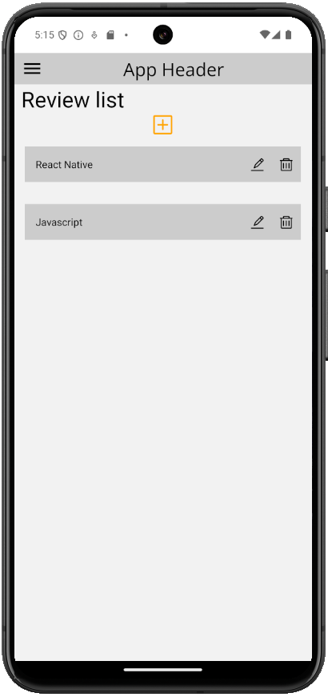

# React Native

 

### React Native là gì
React Native là một framework phát triển ứng dụng di động mã nguồn mở do Facebook phát triển. Nó cho phép bạn xây dựng các ứng dụng di động cho cả iOS và Android bằng cách sử dụng JavaScript và React. Thay vì viết mã riêng biệt cho từng nền tảng, bạn có thể sử dụng React Native để viết một lần và chạy trên cả hai nền tảng.

Một số điểm nổi bật của React Native:
- **Hiệu suất cao**: Ứng dụng React Native có hiệu suất gần như tương đương với ứng dụng gốc (native).
- **Tái sử dụng mã**: Bạn có thể tái sử dụng phần lớn mã giữa các nền tảng, giúp tiết kiệm thời gian và công sức.
- **Cộng đồng lớn**: React Native có một cộng đồng phát triển mạnh mẽ, cung cấp nhiều thư viện và tài nguyên hỗ trợ.

### React Native khác gì so với ReactJS và NextJS

React Native, ReactJS và Next.js đều là các công cụ mạnh mẽ trong việc phát triển ứng dụng web và di động, nhưng chúng có những điểm khác biệt quan trọng:

1. **React Native**:
   - **Mục đích**: Dùng để phát triển ứng dụng di động cho cả iOS và Android.
   - **Ngôn ngữ**: Sử dụng JavaScript và React.
   - **Kết quả**: Tạo ra các ứng dụng di động gốc (native) với hiệu suất cao.
   - **Thư viện**: Cung cấp các thành phần giao diện người dùng gốc như `View`, `Text`, `Button`.

2. **ReactJS**:
   - **Mục đích**: Dùng để phát triển ứng dụng web.
   - **Ngôn ngữ**: Sử dụng JavaScript và React.
   - **Kết quả**: Tạo ra các ứng dụng web tương tác và hiệu suất cao.
   - **Thư viện**: Cung cấp các thành phần giao diện người dùng như `div`, `span`, `button`.

3. **Next.js**:
   - **Mục đích**: Dùng để phát triển ứng dụng web với khả năng render phía server (SSR) và tạo trang tĩnh (SSG).
   - **Ngôn ngữ**: Sử dụng JavaScript và React.
   - **Kết quả**: Tạo ra các ứng dụng web với hiệu suất cao, tối ưu SEO và thời gian tải trang.
   - **Tính năng**: Hỗ trợ SSR, SSG, API routes, và nhiều tính năng khác giúp phát triển ứng dụng web dễ dàng hơn.

### So sánh React Native và Flutter

React Native và Flutter đều là các framework mạnh mẽ để phát triển ứng dụng di động, nhưng chúng có những điểm khác biệt quan trọng:

#### React Native
- **Ngôn ngữ**: Sử dụng JavaScript và React.
- **Hiệu suất**: Ứng dụng React Native có hiệu suất gần như tương đương với ứng dụng gốc (native).
- **Cộng đồng**: Có một cộng đồng phát triển mạnh mẽ và nhiều thư viện hỗ trợ.
- **Tái sử dụng mã**: Bạn có thể tái sử dụng phần lớn mã giữa các nền tảng, giúp tiết kiệm thời gian và công sức.
- **Hỗ trợ**: Được Facebook phát triển và duy trì.

#### Flutter
- **Ngôn ngữ**: Sử dụng Dart, một ngôn ngữ lập trình do Google phát triển.
- **Hiệu suất**: Ứng dụng Flutter thường có hiệu suất cao hơn do nó biên dịch trực tiếp xuống mã gốc (native code).
- **Giao diện người dùng**: Cung cấp nhiều widget tùy chỉnh và linh hoạt, giúp dễ dàng tạo ra giao diện người dùng đẹp mắt.
- **Cộng đồng**: Đang phát triển nhanh chóng với sự hỗ trợ mạnh mẽ từ Google.
- **Hỗ trợ**: Được Google phát triển và duy trì.

#### Nên học cái nào?
- **Nếu bạn đã quen thuộc với JavaScript và React**, React Native có thể là lựa chọn tốt hơn vì bạn sẽ dễ dàng tiếp cận và tận dụng kiến thức hiện có.
- **Nếu bạn muốn học một framework mới và không ngại học ngôn ngữ mới (Dart)**, Flutter có thể là lựa chọn tốt vì nó cung cấp hiệu suất cao và khả năng tùy chỉnh giao diện người dùng mạnh mẽ.

### Học React Native thế nào?

Học React Native có thể là một hành trình thú vị và đầy thử thách. Dưới đây là một số bước cơ bản để bạn bắt đầu:

1. **Nắm vững JavaScript và React**: Trước khi bắt đầu với React Native, bạn nên có kiến thức cơ bản về JavaScript và React. Có rất nhiều tài liệu và khóa học trực tuyến miễn phí để bạn học.

2. **Cài đặt môi trường phát triển**: Bạn cần cài đặt Node.js, npm và React Native CLI. Bạn có thể tham khảo hướng dẫn cài đặt từ [trang web chính thức của React Native](https://reactnative.dev/docs/environment-setup).

3. **Học qua tài liệu chính thức**: Tài liệu chính thức của React Native là nguồn tài nguyên tuyệt vời để bắt đầu. Bạn có thể tìm thấy hướng dẫn, ví dụ và các bài viết chi tiết tại [đây](https://reactnative.dev/docs/getting-started).

4. **Thực hành với các dự án nhỏ**: Bắt đầu với các dự án nhỏ như ứng dụng "Hello World", ứng dụng danh sách công việc (To-Do List) hoặc ứng dụng thời tiết. Điều này sẽ giúp bạn làm quen với các khái niệm cơ bản và cách sử dụng các thành phần của React Native.

5. **Tham gia cộng đồng**: Tham gia các diễn đàn, nhóm Facebook, hoặc các cộng đồng trực tuyến khác để học hỏi từ những người khác và nhận được sự hỗ trợ khi gặp khó khăn.

6. **Xem video hướng dẫn**: Có rất nhiều video hướng dẫn trên YouTube và các nền tảng học trực tuyến như Udemy, Coursera, và Pluralsight. Những video này có thể giúp bạn hiểu rõ hơn về cách sử dụng React Native.

7. **Đọc sách và tài liệu bổ sung**: Có nhiều sách và tài liệu bổ sung về React Native mà bạn có thể tham khảo để nâng cao kiến thức của mình.

*Bài tiếp theo [Tạo ứng dụng Hello World](session_02_setup.md)*